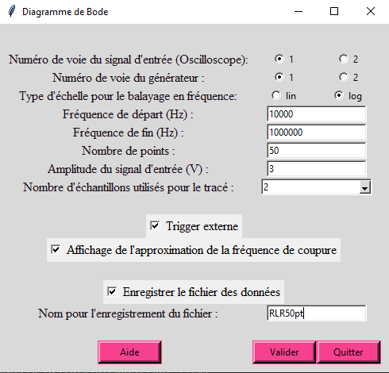

# Projet-Diagramme-Bode

Ce programme sert à la réalisation d'un diagramme de Bode à partir d'un oscilloscope et d'un générateur de références spécifiques. Il sert à automatiser les nombreuses mesures fastidieuses qu'un diagramme de Bode nécessite.

Un diagramme de Bode représente la réponse en fréquence d'un système, par exemple un système linéaire comme un filtre ou encore un amplificateur. 
Ce programme vous donnera au final un diagramme de gain avec le gain du système en décibels (dB) en fonction de la fréquence en échelle linéaire ou logarithmique (au choix). Ainsi qu'un diagramme du déphasage du système (en °) en fonction de la fréquence en échelle linéaire ou logarithmique (au choix). 

:small_blue_diamond: Pour exécuter ce programme il n'est nécessaire de télécharger que le fichier python contenu dans ce github et rien d'autre.  
:small_blue_diamond: : Veillez quand même à songer à allumer les appareils avant de lancer le programme.

## :pen: Auteurs du programme 

Ce programme a été écrit par Adrien TOULOUSE et Manon NOLOT dans le cadre d'un projet d'Acquisition et de Traitement des données de la première année du Master de Physique Numérique de l'université de Montpellier. 

## :toolbox: Références de machines à utiliser

Ce programme a été créé en se servant d'un oscilloscope et d'un GBF spécifiques. Effectivement si vous n'utilisez pas les mêmes les commandes de programmation pourront différer et mener à l'échec du programme. 

**Pour l'oscilloscope** : GDS-1000B Series Digital Storage Oscilloscopes de Gwinstek  
**Pour le générateur** : GDS-1000B Series Digital Storage Oscilloscopes de RIGOL

Il n'est pas nécessaire pour ce programme de renseigner sur quels ports vous avez branchés vos instruments. En effet le programme cherchera par lui-même ces ports en les identifiant grâce à des mots-clés liés à leur référence. 

## :gear: Paramètres que vous pouvez choisir

Voici une présentation des paramètres utilisés dans ce programme, de leur signification et des conditions qu'ils doivent remplir.

**freq_dep** : Correspond à la fréquence de départ par laquelle vous voulez commencer le balayage des fréquences pour le diagramme de Bode. Elle est exprimée en Hz.  
Cette fréquence doit être comprise entre 1E-6 et 3E7 Hz pour respecter les limitations du GBF. Cela doit également être un nombre, peu importe qu'il soit entier ou non. Si ces conditions ne sont pas respectées un message d'erreur s'affichera et vous ne pourrez pas continuer avec le tracé du graphe sans changer vos valeurs.

**freq_fin** : Correspond à la fréquence de fin par laquelle vous voulez finir le balayage des fréquences pour le diagramme de Bode. Elle est exprimée en Hz.  
Cette fréquence doit être strictement plus grande que **freq_dep** et inférieur à 3E7 Hz (pour les limitations du GBF). Cela doit également être un nombre, peu importe qu'il soit entier ou non. Si ces conditions ne sont pas respectées un message d'erreur s'affichera et vous ne pourrez pas continuer avec le tracé du graphe sans changer vos valeurs.

**nb_points** : Correspond au nombre de points voulu sur le diagramme de Bode. Plus le nombre (sans dimension) choisi est grand plus le diagramme de Bode est précis mais aussi plus il est long à tracer.  
Cette valeur doit être un nombre entier plus grand ou égal à 1. Si cette condition n'est pas respectée un message d'erreur s'affichera et vous ne pourrez pas continuer avec le tracé du graphe sans changer vos valeurs.  
Une estimation du temps maximal que peut prendre la mesure en fonction du nombre de points que vous avez renseigné vous sera donnée et il vous sera demandé si sachant cela vous voulez continuer ou non.

**voie_entree** : Correspond à la voie de l'oscilloscope sur laquelle arrive le signal d'entrée de votre circuit quelconque. Cela peut être 1 ou 2 que vous choisirez à l'aide de boutons radios.

**voie_GBF** : Correspond à la voie du GBF qui va généré l'output du signal et sur laquelle est branchée votre câble rejoignant votre circuit. Cela peut être 1 ou 2 que vous choisirez à l'aide de boutons radios.

**amplitude_entree** : L'amplitude désirée pour votre signal d'entrée. Elle est exprimée en V.  
Cette amplitude doit être comprise entre 2.5E-3 V et **amplitude_max** pour respecter les limitations du GBF. Cela doit également être un nombre, peu importe qu'il soit entier ou non. Si ces conditions ne sont pas respectées un message d'erreur s'affichera et vous ne pourrez pas continuer avec le tracé du graphe sans changer vos valeurs.

**moyenne_echantillon** : Le nombre d'échantillons que vous choisissez pour faire une moyenne et mesurer le signal. Il y a plusieurs puissances de 2 au choix : 2, 4, 8, 16, 32, 64, 128 ou 256. Vous en choisirez une à l'aide d'un menu déroulant. 

**echelle** : Correspond à l'échelle du graphique vous choisissez. Ou bien vous aurez un graphe final en échelle linéaire ou bien en échelle semi-logarithmique avec l'échelle des fréquences en échelle logarithmique sur le diagramme du gain. Il est conseillé de choisir l'échelle semi-logarithmique pour une meilleure practicité de lecture mais le choix est laissé à l'utilisateur.  
Vous ferez votre choix à l'aide de boutons radios. 

**frequence_coupure_case** : L'utilisateur peut choisir ou non d'afficher une droite à -3dB sur le graphe final du gain. Cela peut aider à évaluer la fréquence de coupure dans le cas de circuits simples. Attention cela ne vous aidra pas dans le cas de filtres d'ordre élevé, de filtres résonants, de filtres non linéaires ou bien de filtres spéciaux (Butterworth, Chevyshev, etc...).  
Vous pouvez choisir de l'afficher grâce à une case à cocher.

**trigger_externe** = L'utilisateur peut choisir d'avoir un trigger externe si cela peut l'aider à avoir des mesures plus précises.
Vous ferez votre choix à l'aide de boutons radios. 

Il n'est pas important que vous mettiez des points ou des virgules comme séparateurs pour les nombres, "300.7" et "300,7" par exemple fonctionneront de la même manière.

## :lock: Paramètres imposés

**voie_sortie** : Correspond à la voie de l'oscilloscope sur laquelle arrive le signal de sortie de votre circuit quelconque. Par défaut si votre **voie_entree** est 1 ce sera 2 et vice-versa.

**amplitude_max** : Correspond à l'amplitude maximale que le GBF peut produire. Elle est exprimée en V.  
:small_blue_diamond: Si votre fréquence de fin (**freq_fin**) est strictement inférieure à 1E7 Hz alors elle sera de 10V.  
:small_blue_diamond: Si votre fréquence de fin (**freq_fin**) est comprise entre 1E7 Hz inclus et 3E7 Hz exclus alors elle sera de 5V.  
:small_blue_diamond: Si votre fréquence de fin (**freq_fin**) est comprise entre 3E7 Hz inclus et 6E7Hz exclus alors elle sera de 2,5V.

## :pause_button: Boutons de l'interface

**Aide** : En cliquant sur ce bouton vous ouvres une nouvelle fenêtre que vous pouvez garder en parallèle et qui contient des renseignements supplémentaires sur les paramètres à choisir et qui contient le lien vers le github contenant ce README.

**Valider** : En cliquant sur ce bouton, si tous vos paramètres renseignés respectent les conditions, un pop-up s'ouvre et vous renseigne sur le temps maximal que peut prendre la mesure et vous demande si vous voulez tout de même procéder. Si c'est le cas alors l'interface pour choisir vos paramètres disparaîtra, les mesures s'effectueront et une nouvelle fenêtre contenant le graphique s'affichera. Vous pourrez alors zoomer sur ce graphe ou dézoomer à volonté ou bien même l'enregistrer.

**Quitter** : En cliquant sur ce bouton vous l'interface pour choisir vos paramètres se fermera et le programme arrêtera de s'exécuter. Si vous voulez recommencer il faudra relancer le programme.

## :bookmark_tabs: Caractéristiques générales du programme

:small_blue_diamond: Etant donné que vous cherchez à tracer un diagramme de Bode il vous est imposé que le signal d'entrée soit sinusoïdal.  
:small_blue_diamond: Le couplage est en AC sur les deux voies.  
:small_blue_diamond: Lorsqu'il est possible d'éviter un auto-set entre deux fréquences différentes cela est privilégié. Mais lorsque l'on a moins de 2 périodes sur l'échelle de temps ou bien plus de 10 périodes ou alors lorsque l'amplitude du signal n'est plus entre 1,5 divisions et 2,5 divisions un autoset se fera automatiquement pour des soucis de mesures.  
:small_blue_diamond: Le premier autoset pour la première fréquence n'est pas optionnel.  
:small_blue_diamond: Les incertitudes sont affichées sur le graphe final. Si vous n'arrivez pas à les voir c'est que l'incertitude est trop petite. Ces incertitudes sont calculées à l'aide des incertitudes liées à l'oscilloscope (de l'ordre de 3% pour le gain et de 3° pour la phase).  
:small_blue_diamond: La phase est comprise entre 0 et 180°.

## Trigger

L'utilisateur a le choix de choisir un trigger externe ou non. Dans ce cas il a besoin de brancher la voie "EXT TRIG" de l'oscillateur avec la voie "CH1/Sync/Ext Mod/Trig/FSK" à l'arrière du GBF ("CH2/Sync/Ext Mod/Trig/FSK" si l'output est en CH2). 

:small_blue_diamond: Dans le cas où l'utilisateur choisit un trigger externe le niveau du trigger sera automatiquement mis à TTL (Transistor-Transistor Logic).  
:small_blue_diamond: Dans le cas où l'utilisateur ne choisit pas un trigger externe la source du trigger sera le signal d'entrée et son niveau sera mis à 0. 

## Enregistrement

Il est possible d'enregistrer un fichier avec les données du diagramme de Bode, pour cela il faut cliquer sur la case "Enregistrer le fichier des données".  
Dans ce fichier seront : une en-tête avec les paramètres qui ont été utilisés (la plage de fréquence et l'échelle avec laquelle elle a été balayée, l'amplitude d'entrée choisie et le nombre de points choisis), puis un tableau avec une ligne d'étiquettes contenant les fréquences, l'incertitude des fréquences, les gains, l'incertitude des gains, les phases et les incertitudes des phases. 

Ce fichier s'enregistrera dans le même dossier où votre programme est enregistré. C'est-à-dire que si vous enregistrer le programme sur le bureau le fichier se trouvera sur le bureau, mais si vous enregistrez votre programme dans un dossier quelconque le fichier s'enregistrera dans ce dossier quelconque. 

Le fichier aura le nom que vous lui donnerez dans le champ de saisi "Nom pour l'enregistrement du fichier" avec une extension txt qui se met automatiquement. Si vous ne choisissez pas de nom pour le fichier, ce dernier s'enregistrera tout de même sous le nom "Diagramme_Bode.txt" si vous cochez la case pour enregistrer. Cependant il faut faire attention car la prochaine fois que vous enregistrerez un fichier sans choisir de nom il remplacera le précédent du même nom "Diagramme_Bode.txt". Il est donc conseillé de choisir un nom à tous vos fichiers.  
Nous avons choisit de faire le choix de l'écrasement pour éviter de polluer l'ordinateur avec par exemple des "Diagramme_Bode1.txt", "Diagramme_Bode2.txt", "Diagramme_Bode3.txt"... etc. Cela force ainsi l'utilisateur à nommer ses fichiers et à terme à moins s'y perdre.

Pour faciliter la récupération des données dans par exemple un tableur csv nous avons fait en sorte que les données du tableau soient alignées pour en faciliter la séparation. 

## :books: Modules utilisés

Les modules utilisés lors de l'éxécution de ce programme sont les suivants : **pyvisa**, **time**, **numpy**, **matplotlib.pyplot**, **sys**, **tkinter**. 

**numpy**, **matplotlib.pyplot**, **sys** et **tkinter** sont des bibliothèques Python standard qui sont généralement incluses dans les distributions Python courantes. Vous ne devriez pas avoir à les installer séparément. 

**pyvisa** par contre est une bibliothèque externe et devra peut-être être installée séparément. Elle est cependant essentielle car c'est elle qui va permettre de contrôles les instruments de mesure. 
Voici les étapes à faire pour l'installer : 
1) Il faut s'assurer d'avoir python d'installer sur votre système. Pour vérifier cela vous pouvez exécuter la commande suivante dans votre terminal : **python --version**
2) Si Python n'est pas installé songez à le faire, sinon ce programme ne pourra pas fonctionner. Si Python est bien installé effectuer la commande suivante : **pip install pyvisa**
3) Attendez que l'installation soit terminée. Une fois l'installation réussie, le programme devrait s'exécuter sans soucis.

## :telephone: Aide

Si vous avez besoin d'aide ou de renseignements ou bien vous pouvez vous servir de ce README relativement complet, ou bien vous avez deux autres options.  
La première est que lorsque vous lancer le programme, dans l'interface où vous devez renseigner vos paramètres il y a un bouton aide. Si vous cliquez dessus une fenêtre s'ouvrira que vous pouvez garder ouverte en parallèle et dans laquelle vous avez des renseignements concernant les paramètres et le lien vers ce github contenant ce README.  
Autrement le fichier python associé à ce projet et permettant de lancer le programme est commenté de manière détaillée. 

## :wrench: Comment lancer ce programme ?

Vous avez plusieurs options pour lancer ce programme. Nous vous en proposerons deux :  
:small_blue_diamond: Ou bien utiliser des IDE (environements de dévelopement intégrés) comme Spyder ou bien encore Visual Studio Code (VS Code) ou PyCharm.  
:small_blue_diamond: Ou bien directement utiliser le terminal. Depuis la racine dirigez vous vers l'endroit où vous avez enregistrer le fichier python de ce github à l'aide de **cd** par exemple. Puis une fois là où le fichier est enregistré exécutez la commande : **python3 merge\ interf-projet\ V2\ -\ Copie.py**.  Bien sûr vous pouvez modifier cette commande en fonction de la version de python que vous avez d'installé ou bien directement mettre le chemin complet du fichier au lieu de naviguer jusqu'au dossier où il se trouve.  

## :camera: Images de l'interface

Cette interface n'est pas très moderne. C'est un choix. En effet il aurait été possible de la rendre plus moderne mais pour cela il aurait été probablement nécessaire que l'utilisateur installe d'autres bibliothèques externes en plus de **pyvisa**. Nous avons donc préféré avoir un look un peu moins moderne au profit d'une meilleure portabilité.
